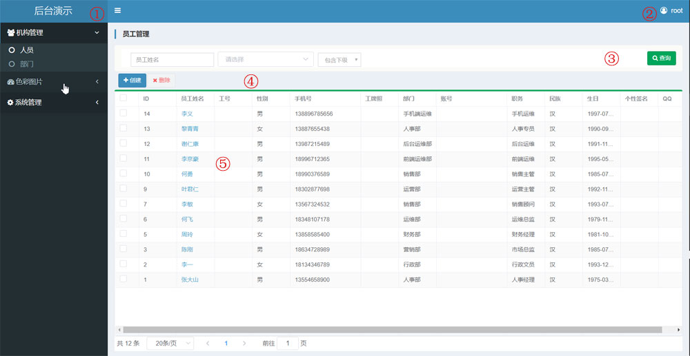

# 演示后台

我们提供定制化的**管理后台**开发服务，重点是BS架构的软件开发。*B:Brower浏览器;S:server远程服务器*

普通的管理后台大致包括后端`数据处理逻辑`及其前端`管理界面`以及面向app等前端`api接口`。
在本系统中(本演示后台)用于演示目的，只关注**管理界面以及相应数据处理逻辑**，我们通过几个小的模块，向您大致演示下系统的基本功能。

## 开发方式及特点

我们开发目标是**中小型管理后台**，我们的开发架构采用，后端`python/django`,前端`vue.js`的形式。`python`是非常优秀和流行的动态语言，语法简单，维护方便，除了现在流行的AI应用外，还被大量应用在web后端开发中。`django`作为`python`web生态最重要的框架，提供的`orm`数据库组件极其优秀，能够自动管理和映射数据库表。大大简化和加速了开发过程。`vue.js`是当前最流行的前端组件化框架，其简单实用，运行效率高。利用`vue.js`将前端完全组件化后，可以配合后端`ORM`根据数据库结构自动组织管理界面，可以达到无与伦比的开发效率。此外带来了功能强大，但是结构简洁的**权限**系统。
此外，由于多年的工作以及个人兴趣，我们累积了大量的实践经验，完全可控的基于django的`开发框架`，可以做到灵活快速的响应客户不断变化的需求。

对于BS架构的软件，一般团队是分成两拨人进行开发。后端人员负责后端数据的处理（如存储于查询），并且向前端提供接口。前端人员复杂编写界面，展示数据，提供表单编辑数据。这种方式称为*前后端分离*的开发方式，较为通用，适合招聘对口人才，对于**大型项目**，需要多人协作，基本都采用前后端分离的方式。但是需要前后端协商沟通，开发效率并不高，软件排错和修改也比较麻烦。

普通**中小型**项目，往往有以下几个特点:

* 用户往往并不清楚自己想要的效果，在项目开发过程中，需求会不断发生变化。
* 投入资源有限，开发人员少。

不断变化的需求，必然造成其后台开发面临着无数次的修改。项目也从一些模糊抽象的理念一点点蜕变为具体的实体软件。这个雕琢的过程会带来大量*无中生有*的工作量，一旦超过开发人员的能力限度，会造成代码失控。一旦代码失控，开发人员将会放之任之，交差了事。对后期的继续开发和维护造成极大隐患。

在中小项目中，参与的人员少，沟通成本较低。开发人员独立性强，非常适合使用灵活性高的动态语言。`python`的使用增加了开发人员对代码的控制力。以前5个人写的业务，现在1个人就能搞定。而`python`过于灵活，代码约束少，难于检查的弱点，刚好在中小型项目中得到了缓解。

总之，我们具备丰富的**中小型管理后台**开发经验，能够快速的响应用户需求变更，以及长期维护的需求。

```eval_rst
.. Note:: 很多团队不管项目的规模大小，一概采用前后端分离的开发模式，造成他们的开发成本非常高。当vue.js这类前端组件化框架成熟后，使得我们团队能够进化出更加高效的开发方式，使用非前后端分离的方式开发中小型项目。
```

## 管理界面

后台的界面如下



1. 主菜单区域。由一个树状菜单构成，可以点击白色小方块收缩。
2. 用户菜单。可以退出或者修改密码。
3. 过滤条件区域。包括搜索条件，各种过滤条件，以及搜索按钮。
4. 功能按钮区，包含该页面支持的各种操作.
5. 数据区域。蓝色的列一般代表可以点击。


